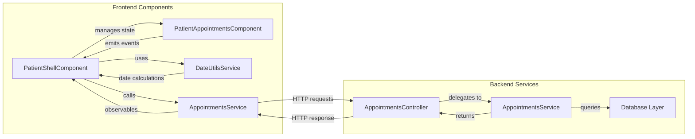
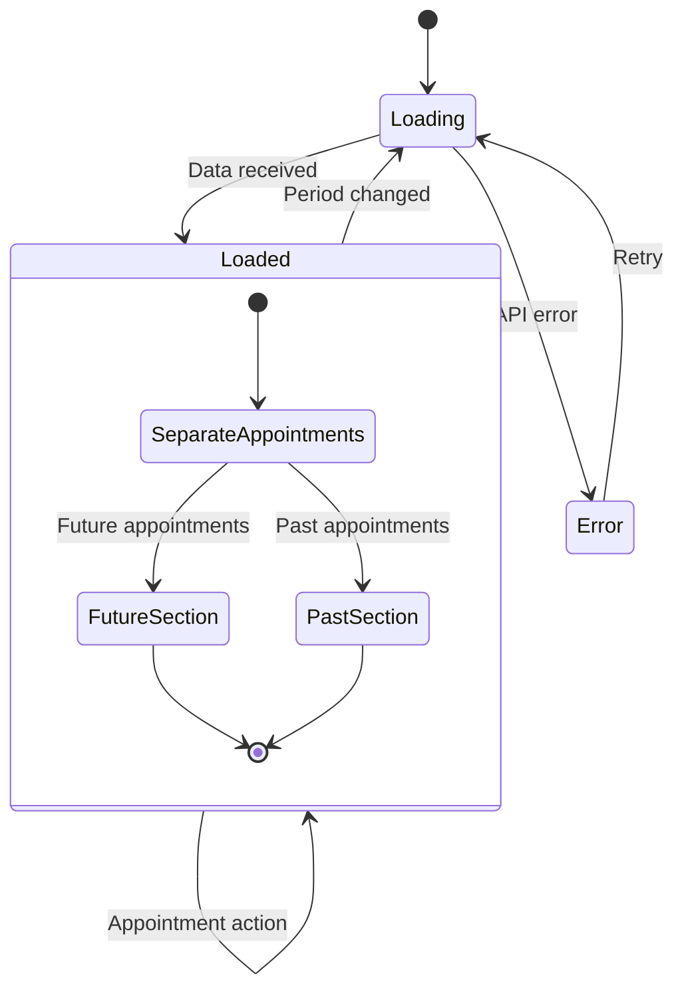
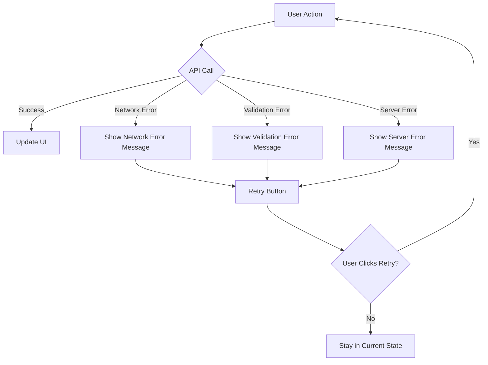
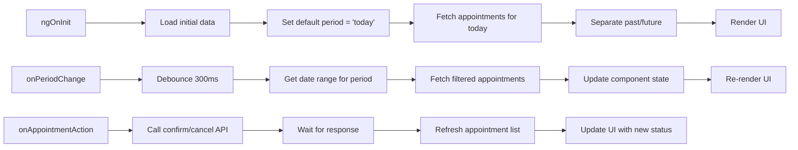

# "Mis Turnos" Data Flow Architecture

## System Flow Diagram

```mermaid
graph TD
    A[Patient selects time period] --> B[PatientShellComponent]
    B --> C[DateUtilsService.getPeriodRange]
    C --> D[AppointmentsService.listForPatientFiltered]
    D --> E[Backend API: GET /appointments/patients/{id}/filtered]
    E --> F[AppointmentsService.list_for_patient_filtered]
    F --> G[Database Query with Date Range]
    G --> H[Filtered Appointments Response]
    H --> I[PatientShellComponent separates past/future]
    I --> J[PatientAppointmentsComponent renders]
    
    K[Patient changes period] --> L[Debounce period change]
    L --> A
    
    M[Patient confirms/cancels appointment] --> N[PatientAppointmentsComponent.emit]
    N --> O[PatientShellComponent.handleAction]
    O --> P[AppointmentsService.confirm/cancel]
    P --> Q[Backend API: POST /appointments/{id}/action]
    Q --> R[Update appointment status]
    R --> S[Refresh filtered appointments]
    S --> I
```

## Component Interaction Diagram



## Data Transformation Flow

```mermaid
sequenceDiagram
    participant U as User
    component PSC as PatientShellComponent
    component DUS as DateUtilsService
    component AS as AppointmentsService
    component API as Backend API
    component DB as Database
    
    U->>PSC: Selects "Esta semana"
    PSC->>DUS: getThisWeekRange()
    DUS-->>PSC: {start: Date, end: Date}
    PSC->>AS: listForPatientFiltered(id, start, end)
    AS->>API: GET /appointments/patients/{id}/filtered
    API->>DB: SELECT * WHERE patient_id = id AND start_at BETWEEN start AND end
    DB-->>API: Appointment records
    API-->>AS: AppointmentDto[]
    AS-->>PSC: Observable<AppointmentDto[]>
    PSC->>PSC: Separate past/future appointments
    PSC-->>U: Render organized appointments
```

## State Management Flow



## API Request/Response Flow

```mermaid
graph TD
    A[Frontend Request] --> B[HTTP GET /appointments/patients/{id}/filtered]
    B --> C{Query Parameters}
    C -->|start_date| D[ISO Date String]
    C -->|end_date| E[ISO Date String]
    D --> F[Backend Validation]
    E --> F
    F --> G[Service Layer Processing]
    G --> H[Database Query]
    H --> I[Raw Appointment Data]
    I --> J[Schema Transformation]
    J --> K[AppointmentDto[]]
    K --> L[HTTP Response]
    L --> M[Frontend Processing]
    M --> N[Separate Past/Future]
    N --> O[UI Rendering]
```

## Error Handling Flow



## Component Lifecycle Flow



## Performance Optimization Flow

```mermaid
graph TD
    A[User selects period] --> B{Data cached?}
    B -->|Yes| C[Return cached data]
    B -->|No| D[Make API call]
    D --> E[Store in cache]
    E --> F[Return data]
    
    C --> G[Update UI immediately]
    F --> G
    
    H[User selects adjacent period] --> I[Preload data]
    I --> J[Cache for future use]
    
    K[Component destroyed] --> L[Clear cache]